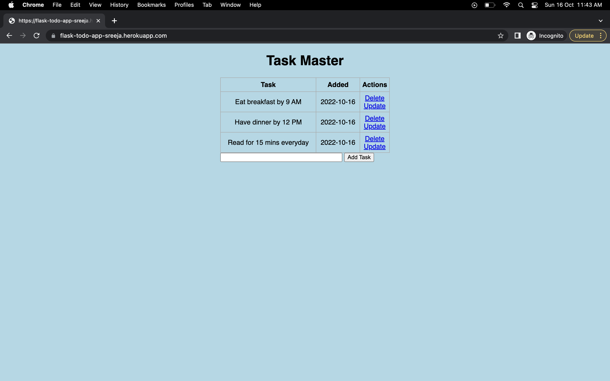

### To-Do App to keep a track of your To-Do items for the day.

This application is built using Flask framework with CRUD APIs and sqlite db. Front end created using Jinja Templating.]
Depoyed it on Heroku , check the below the screenshot.

